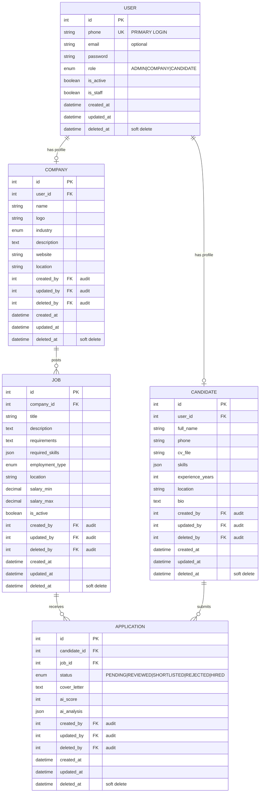

# Mini-SBR Database Schema (ERD)

## Overview

This document describes the database schema for Mini-SBR, an AI-powered recruitment platform.

**Key Patterns Used:**
- **Soft Deletes**: Records are never truly deleted, just marked with `deleted_at`
- **Audit Trail**: All records track who created/updated/deleted them
- **Role-Based Access**: Users have roles (enum) that determine permissions

---

## Entity Relationship Diagram



---

## Relationships

| Relationship | Type | Description |
|--------------|------|-------------|
| User → Company | 1:1 | A company user has one company profile |
| User → Candidate | 1:1 | A candidate user has one candidate profile |
| Company → Job | 1:N | A company can post many jobs |
| Job → Application | 1:N | A job can receive many applications |
| Candidate → Application | 1:N | A candidate can submit many applications |

---

## User Roles (Enum)

**Roles are stored as an enum field (TextChoices) in the User model:**

| Role | Value | Description |
|------|-------|-------------|
| `ADMIN` | Admin | Platform administrator |
| `COMPANY` | Company | Company/recruiter account |
| `CANDIDATE` | Candidate | Job seeker account |

```python
class UserRole(models.TextChoices):
    ADMIN = 'ADMIN', 'Admin'
    COMPANY = 'COMPANY', 'Company'
    CANDIDATE = 'CANDIDATE', 'Candidate'

class User(AbstractUser):
    role = models.CharField(max_length=20, choices=UserRole.choices)
```

### ApplicationStatus
```
PENDING     - Newly submitted, awaiting review
REVIEWED    - Seen by recruiter
SHORTLISTED - Selected for next stage
REJECTED    - Not selected
HIRED       - Offer accepted
```

### EmploymentType (for Jobs)
```
FULL_TIME   - Full-time position
PART_TIME   - Part-time position
CONTRACT    - Contract/temporary
INTERNSHIP  - Internship position
```

### Industry (for Companies)
```
TECH         - Technology
CONSTRUCTION - Construction
HEALTHCARE   - Healthcare
FINANCE      - Finance
EDUCATION    - Education
RETAIL       - Retail
OTHER        - Other
```

---

## Base Model Pattern

All models (except User) inherit from a `BaseModel` that provides:

```python
class BaseModel(models.Model):
    """Base model with audit trail and soft deletes"""

    # Audit fields - WHO did what
    created_by = models.ForeignKey(User, related_name='+')
    updated_by = models.ForeignKey(User, related_name='+')
    deleted_by = models.ForeignKey(User, related_name='+', null=True)

    # Timestamp fields - WHEN it happened
    created_at = models.DateTimeField(auto_now_add=True)
    updated_at = models.DateTimeField(auto_now=True)
    deleted_at = models.DateTimeField(null=True)  # Soft delete

    class Meta:
        abstract = True
```

**Why this pattern?**
- **Audit Trail**: Know who created/modified every record
- **Soft Deletes**: Never lose data, can always restore
- **Consistency**: All models behave the same way

---

## JSON Field Structures

### skills (Candidate)
```json
["Python", "Django", "REST APIs", "PostgreSQL", "Git"]
```

### required_skills (Job)
```json
["Python", "Django", "REST APIs", "PostgreSQL"]
```

### ai_analysis (Application)
```json
{
  "skill_match": 85,
  "experience_match": 70,
  "education_match": 80,
  "strengths": ["Python", "Team leadership"],
  "gaps": ["Cloud experience"],
  "recommendation": "Good fit for mid-level position",
  "confidence": 0.82
}
```

---

## Visual Schema

```
┌─────────────────────────────────────────────────────────────────────┐
│                              USER                                    │
│  id | phone (UK) | email | password | role (enum)                   │
│  is_active | is_staff | timestamps                                  │
│  USERNAME_FIELD = phone (!)                          │
│  role: ADMIN | COMPANY | CANDIDATE                                  │
└─────────────────────────────────────────────────────────────────────┘
            │                                    │
            │ (role=COMPANY)                     │ (role=CANDIDATE)
            ▼                                    ▼
┌─────────────────────────┐          ┌─────────────────────────┐
│       COMPANY           │          │      CANDIDATE          │
│  + BaseModel fields     │          │  + BaseModel fields     │
│  name | industry        │          │  full_name | cv_file    │
│  logo | website         │          │  skills | experience    │
│  location | description │          │  location | bio         │
└─────────────────────────┘          └─────────────────────────┘
            │                                    │
            │ 1:N                                │ 1:N
            ▼                                    │
┌─────────────────────────┐                      │
│         JOB             │                      │
│  + BaseModel fields     │                      │
│  title | description    │                      │
│  requirements | skills  │                      │
│  employment_type        │                      │
│  location | salary      │                      │
│  is_active              │                      │
└─────────────────────────┘                      │
            │                                    │
            │ 1:N                                │
            ▼                                    │
┌─────────────────────────────────────────────────┐
│               APPLICATION                        │
│  + BaseModel fields                             │
│  candidate_id | job_id                          │
│  status | cover_letter                          │
│  ai_score | ai_analysis                         │
└─────────────────────────────────────────────────┘
```

---

## Indexes (Recommended)

| Table | Column(s) | Type | Purpose |
|-------|-----------|------|---------|
| User | phone | Unique | Login lookup (USERNAME_FIELD) |
| User | email | Unique (nullable) | Optional email lookup |
| User | role | Index | Filter by role |
| Job | company_id | Index | Company's jobs |
| Job | is_active, created_at | Index | Active job listings |
| Job | deleted_at | Index | Soft delete filter |
| Application | job_id | Index | Applications per job |
| Application | candidate_id | Index | Candidate's applications |
| Application | status | Index | Filter by status |
| Application | (job_id, candidate_id) | Unique | Prevent duplicate applications |
| All tables | deleted_at | Index | Soft delete queries |

---

## Soft Delete Behavior

```python
# Normal query - only returns active (non-deleted) records
Job.objects.all()  # WHERE deleted_at IS NULL

# Include deleted records
Job.all_objects.all()  # No filter

# Soft delete a record
job.delete()  # Sets deleted_at = now(), deleted_by = current_user

# Hard delete (permanent) - use carefully!
job.delete(hard=True)  # Actually removes from database
```
