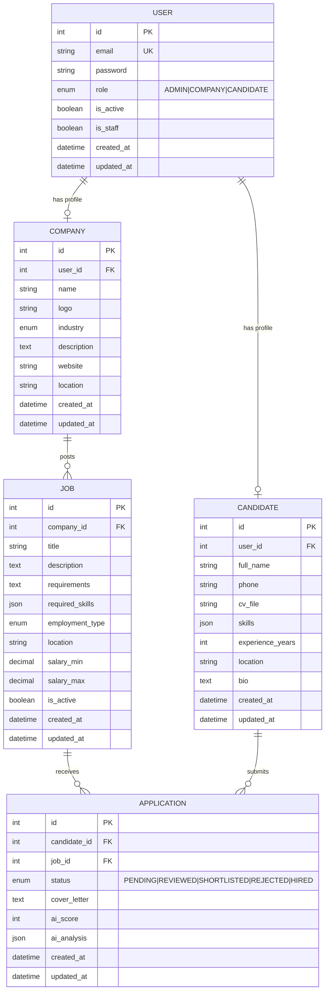

# Mini-SBR Database Schema (ERD)

## Entity Relationship Diagram



---

## Relationships

| Relationship | Type | Description |
|--------------|------|-------------|
| User → Company | 1:1 | A company user has one company profile |
| User → Candidate | 1:1 | A candidate user has one candidate profile |
| Company → Job | 1:N | A company can post many jobs |
| Job → Application | 1:N | A job can receive many applications |
| Candidate → Application | 1:N | A candidate can submit many applications |

---

## Enums

### UserRole
```
ADMIN      - Platform administrator
COMPANY    - Company/recruiter account
CANDIDATE  - Job seeker account
```

### ApplicationStatus
```
PENDING     - Newly submitted, awaiting review
REVIEWED    - Seen by recruiter
SHORTLISTED - Selected for next stage
REJECTED    - Not selected
HIRED       - Offer accepted
```

### EmploymentType (for Jobs)
```
FULL_TIME   - Full-time position
PART_TIME   - Part-time position
CONTRACT    - Contract/temporary
INTERNSHIP  - Internship position
```

### Industry (for Companies)
```
TECH         - Technology
CONSTRUCTION - Construction
HEALTHCARE   - Healthcare
FINANCE      - Finance
EDUCATION    - Education
RETAIL       - Retail
OTHER        - Other
```

---

## JSON Field Structures

### skills (Candidate)
```json
["Python", "Django", "REST APIs", "PostgreSQL", "Git"]
```

### required_skills (Job)
```json
["Python", "Django", "REST APIs", "PostgreSQL"]
```

### ai_analysis (Application)
```json
{
  "skill_match": 85,
  "experience_match": 70,
  "education_match": 80,
  "strengths": ["Python", "Team leadership"],
  "gaps": ["Cloud experience"],
  "recommendation": "Good fit for mid-level position",
  "confidence": 0.82
}
```

---

## Visual Schema

```
┌─────────────────────────────────────────────────────────────────────┐
│                              USER                                    │
│  id | email | password | role | is_active | is_staff | created_at   │
└─────────────────────────────────────────────────────────────────────┘
            │                                    │
            │ (role=COMPANY)                     │ (role=CANDIDATE)
            ▼                                    ▼
┌─────────────────────────┐          ┌─────────────────────────┐
│       COMPANY           │          │      CANDIDATE          │
│  id | user_id | name    │          │  id | user_id | name    │
│  logo | industry        │          │  phone | cv_file        │
│  website | location     │          │  skills | experience    │
│  description            │          │  location | bio         │
└─────────────────────────┘          └─────────────────────────┘
            │                                    │
            │ 1:N                                │ 1:N
            ▼                                    │
┌─────────────────────────┐                      │
│         JOB             │                      │
│  id | company_id        │                      │
│  title | description    │                      │
│  requirements           │                      │
│  required_skills        │                      │
│  employment_type        │                      │
│  location | salary      │                      │
│  is_active              │                      │
└─────────────────────────┘                      │
            │                                    │
            │ 1:N                                │
            ▼                                    │
┌─────────────────────────────────────────────────┐
│               APPLICATION                        │
│  id | candidate_id | job_id                     │
│  status | cover_letter                          │
│  ai_score | ai_analysis                         │
│  created_at | updated_at                        │
└─────────────────────────────────────────────────┘
```

---

## Indexes (Recommended)

| Table | Column(s) | Type | Purpose |
|-------|-----------|------|---------|
| User | email | Unique | Login lookup |
| Job | company_id | Index | Company's jobs |
| Job | is_active, created_at | Index | Active job listings |
| Application | job_id | Index | Applications per job |
| Application | candidate_id | Index | Candidate's applications |
| Application | status | Index | Filter by status |
| Application | (job_id, candidate_id) | Unique | Prevent duplicate applications |
